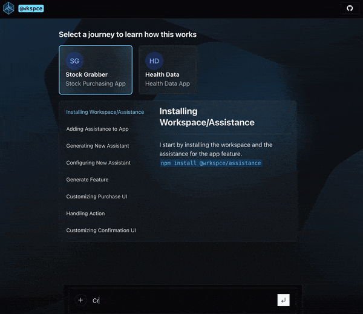
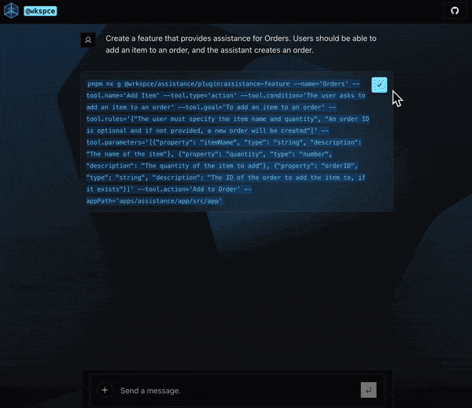
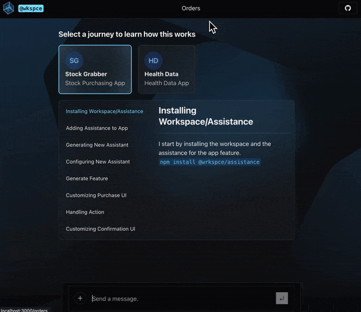

# @wrkspce

@wrkspce aims to boost developers' efficiency through AI tools.

[View Demo](https://wrkspce.vercel.app/)

## Assistance
Leveraging AI in Software Development

Through the integration of AI technology, we have the ability to automate monotonous tasks, augment decision-making processes, and in the grand scheme of things, streamline the entire software development lifecycle. This system is not merely a testament to the capabilities of AI, but it also highlights the potential of human creativity when used to aid others in their success.

## Example Usage

### Orders Assistant
**Goal**: An AI assistant that generates order forms.

1. Run app and prompt assistant with new feature: 
2. Alter the configuration of the assistant: 
3. Paste the code in the terminal: 
4. Run app and access new assistant: 

## More to come...

About @Patrick Neiler

With my background in handling highly complex enterprise projects, I am uniquely equipped to handle the intricate challenges associated with the integration of AI in software development, further enhancing the potential of **@wrkspce**.

As the architect of this system, my enthusiasm is deeply rooted in crafting innovative solutions that enable others to construct more effective systems.

Through the integration of AI technology, we have the ability to automate monotonous tasks, augment decision-making processes, and in the grand scheme of things, streamline the entire software development lifecycle. This system is not merely a testament to the capabilities of AI, but it also highlights the potential of human creativity when used to aid others in their success.

<aside>
📢 Connect with me on LinkedIn: [@patrickneiler](https://www.linkedin.com/in/patrickneiler)

</aside>
